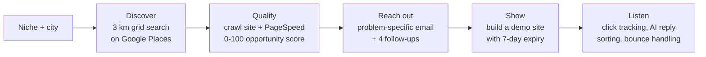

# SiteScout

An automated outreach pipeline that finds local businesses whose websites are losing them customers, then shows each owner a better version of their own site before asking for anything.

I built SiteScout to show my PM skills end to end: not just understanding the business problem, but rapid prototyping, fixing bugs in production and deploying it myself. The product question it tests: **do people respond better when you show them a better version of what they have, instead of pitching them?**

**Read the case study:** [cyrilbosch.vercel.app/sitescout](https://cyrilbosch.vercel.app/sitescout)

---

## What it does

I give it one input, a niche and a city such as `Hair salons, Wichita, KS`. Everything after that runs on a schedule every 10 minutes.



| Stage | What happens | Main files |
|---|---|---|
| Discover | Splits the metro area into 3 km search circles, because one broad Places search stops at about 60 results. Hard monthly cap on API calls. | `lead_discovery_and_evaluation_Contactsearch.py`, `geo_grid.py`, `hp_api_budget.py` |
| Qualify | Crawls each site for online booking and a call button, runs PageSpeed, and produces a score plus a plain-English reason. | `website_crawler.py`, `opportunity_scoring.py` |
| Reach out | AI-written first email that leads with the specific problem found, then a timed follow-up sequence in the lead's local morning. | `cold_email.py`, `hp_llm.py`, `email_templates/` |
| Show | Builds a demo ("ghost") site from the business's real content and deploys it to Cloudflare Pages. | `ghost_site_builder.py`, `cloudflare_pages.py`, `ghost_site_sequence.py`, `ghost_site_expiry.py` |
| Listen | Tracks demo-site clicks, classifies replies with AI, and catches bounced emails. | `inbox_monitoring.py`, `bounce_check.py`, `deploy/tracking-worker.js` |
| Operate | Orchestrator with a run lock, daily reporting, and a Flask admin dashboard. | `orchestrator.py`, `hp_lock.py`, `daily_reporting.py`, `dashboard/app.py` |

## Opportunity score

Weighted toward what actually costs a business customers, not what merely looks old:

| Signal | Weight |
|---|---|
| No online booking | 40 |
| No call-to-action button | 30 |
| Poor mobile performance | 20 |

When the crawler can't tell whether a feature exists, it scores a quarter of the weight. Online booking alone decides pass or fail; the other signals rank the leads that pass.

## Design choices worth knowing

- **Safe by default.** `HP_ENV` defaults to development. Outside production, `--live` is ignored and every email is redirected to a test address. See `scripts/hp_env.py`.
- **Costs can't surprise you.** Discovery stops at 4,999 Places calls a month and resumes on the 1st.
- **Failures are loud.** The system refuses to start without required keys, and failed runs trigger an alert instead of dropping leads silently.
- **Deliverability first.** New sends are capped per day, and `cold_email_paused` in `config.yaml` stops all outreach during mailbox warmup.

## Stack

Python, Flask, SQLite, Notion API (CRM), Google Places and PageSpeed APIs, Gemini API, Cloudflare Pages and Workers, himalaya (email CLI), cron or launchd on a free Google Cloud VM.

## Running it locally

```bash
python3 -m venv venv
venv/bin/pip install -r requirements.txt pytest
cp .env.example .env    # fill in your own keys; HP_ENV=development keeps sends safe
venv/bin/python3 scripts/orchestrator.py          # dry run
venv/bin/python3 dashboard/app.py                 # admin dashboard on 127.0.0.1
```

Run the tests (no real keys needed):

```bash
HP_ENV=development NOTION_API_KEY=x NOTION_DATA_SOURCE_ID_TEST=x NOTION_DATABASE_ID_TEST=x \
GEMINI_API_KEY=x GOOGLE_PLACES_API_KEY=x venv/bin/python3 -m pytest -q
```

738 tests cover discovery, scoring, outreach, the ghost-site sequence, inbox handling and the orchestrator.

## Notes

- Module names starting with `hp_` come from the project's original codename.
- Business names, contact details and all lead data are left out on purpose. Test fixtures use fictional businesses.
- Tunable settings live in `config.yaml`; secrets live only in `.env`, which is git-ignored.

---

Built by [Cyril Savari Bosch](https://cyrilbosch.vercel.app), product manager. [LinkedIn](https://www.linkedin.com/in/cyrilprakash)
